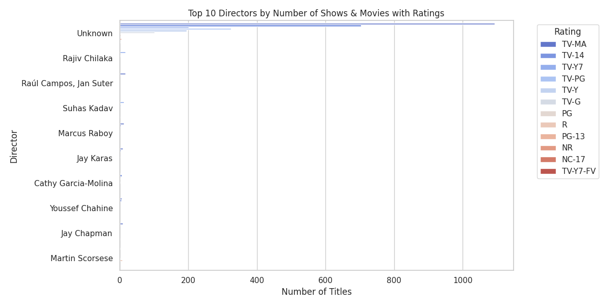
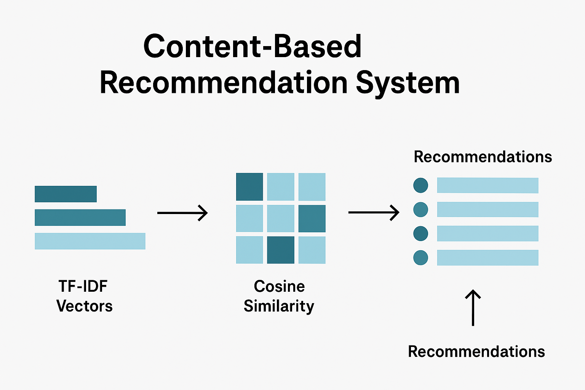

# Netflix Dataset Analysis

This project explores Netflix’s catalog of movies and TV shows, focusing on **content trends, duration, ratings, genres, countries, directors, and cast members**. All plots are generated with **Seaborn and Matplotlib**.

---

## **1. Top Countries Producing Content**

* The **US produces the most content** by far.
* **India** comes second, producing less than half of US content.
* **Unknown countries** (missing data) come third.
* The UK is fourth, with a significant drop-off after the top 4.


---

## **2. Content Duration**

### **Movies**

* Most movies last around **90 minutes**, with a large number around **100 minutes**.
* Standard feature film lengths dominate the catalog.


### **TV Shows**

* Most shows have **1 season**.
* Fewer shows have 2 seasons, and very few have more than 2.
* Netflix focuses on single-season or short-series content.


---

## **3. Ratings and Directors**

* Many directors are **unknown**, reflecting incomplete metadata.
* Among known ratings, **TV-MA** dominates for Netflix shows.
* Top 10 directors (by number of titles) with their ratings:



---

## **4. Popular Cast Members**

* Vast majority of cast members are unknown.
* Among the known cast, the top 10 actors/actresses (by number of appearances) are:
  **Anupam Kher, Shah Rukh Khan, Julie Tejwant, Naseeruddin Shah, Takahiro Sakurai, Rupa Bhimani, Akshay Kumar, Om Puri, Yuki Kaji**


---

## **5. Top Genres**

* Most popular genres (split by commas) are:

  * Dramas
  * International Movies
  * Documentaries
  * Stand-up Comedy
  * Comedies

* Netflix content is heavily skewed towards **dramas and international films**.


---

## **6. Release Years**

* The majority of content was released between **2016 and 2020**, with **2018 peaking**.
* From 2021 onwards, releases drop significantly, possibly reflecting production delays or incomplete data.


---

## **7. Key Takeaways**

* **Netflix focuses on short TV series** (mostly 1 season).
* **Movies are mostly standard feature length** (90–100 minutes).
* **US dominates content production**, with India as a distant second.
* **Metadata gaps** exist: many directors and cast members are unknown.
* **Popular genres** are drama-heavy, with a strong presence of international films and comedies.
* **TV-MA rating** dominates, reflecting adult content preferences.

---

## **8. Content-Based Recommendation System**

This project also includes a **simple content-based recommender** for Netflix shows and movies.

* Uses **genres (`listed_in`)** to compare content.
* Converts genres into **numerical vectors** using **TF-IDF (Term Frequency–Inverse Document Frequency)**.
* Computes **cosine similarity** between shows to find the most similar ones.
* Returns **top 5 recommendations** for a given show or movie.

---

### **How It Works**

1. **TF-IDF Vectorization**

   * Each show’s genres are converted into a **vector representing the importance of each genre** in the dataset.
   * Common words like “and”, “the” are ignored using `stop_words='english'`.

2. **Cosine Similarity**

   * Measures similarity between all shows based on their genre vectors.
   * Values range from **0 (completely different)** to **1 (identical)**.

3. **Recommendation Function**

   * Input: title of a show or movie.
   * Output: list of **top 5 most similar shows**.



---

### **Example Usage**

```python
from recommender import recommend

# Example recommendation
recommend("Blood & Water")
```

**Output:**

```
['Into the Night', 'Open Your Eyes', 'Between', 'Girl from Nowhere', 'Ray']
```

* These are the **5 shows most similar in genre** to “Blood & Water”.

---

### **Key Points**

* This is a **content-based approach** — it does not consider user ratings or watch history.
* Can be **extended** by including:

  * Cast information
  * Directors
  * Description/plot keywords
